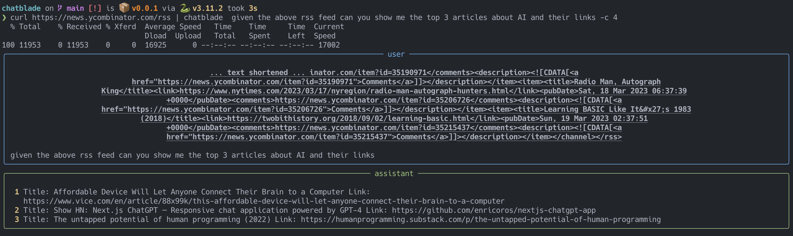
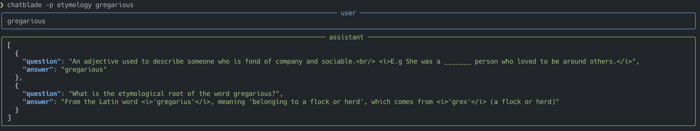

# Chatblade
## A CLI Swiss Army Knife for ChatGPT

Chatblade is a versatile command-line interface (CLI) tool designed to interact with OpenAI's ChatGPT. It accepts piped input, arguments, or both, and allows you to save common prompt preambles for quick usage. Additionally, Chatblade provides utility methods to extract JSON or Markdown from ChatGPT responses.

**Note**: You'll need to set up your OpenAI API key to use Chatblade.

You can do that by either passing `--openai-api-key KEY` or by setting an env variable `OPENAI_API_KEY` (recommended). The examples below all assume an env variable is set.

## Install

### Latest and greatest

To stay up to date with the current main branch you can:
- check out the project, and run `pip install .`
- or `pip install 'chatblade @ git+https://github.com/npiv/chatblade'`

### Via pypi

The last released version can be installed with `pip install chatblade --upgrade`

### Via Brew

```
brew install chatblade
```

## Documentation

### Making queries

#### A new conversation

You can begin any query by just typing. eg

```bash
chatblade how can I extract a still frame from a video at 22:01 with ffmpeg
```


#### recall the last conversation

if you would like to recall the last conversation just call it back with `-l`

```bash
chatblade -l
```

#### Continue the last conversation

To continue the conversation and ask for a change within the context, you can again use `-l` but with a query.

```bash
chatblade -l can we make a gif instead from 00:22:01 to 00:22:04
```

`-l` is shorthand for `-S last` or the last session. We can keep track of and continue various distinct conversations using the [session options](#session-options)


#### Picking between gpt-3.5 and 4

By default gpt-3.5 is used, you can switch at any point to 4 by using `-c 4` or the latest gpt-4-1106-preview by using `-c 4t`

Additionally you can pass any arbitrary full model name, eg `-c gpt-3.5-turbo-16k`

#### Chatting interactively

If you would prefer to chat interactively instead just use `chatblade -i`.

#### Show streaming text (experimental)

You can also stream the responses, just like in the webui. At the end of the stream it will format the result. This can be combined in an interactive session

```chatblade -s -i```

https://user-images.githubusercontent.com/452020/226891636-54d12df2-528f-4365-a4f3-e51cb025773c.mov


### Formatting the results

Responses are parsed and if chatblade thinks its markdown it will be presented as such, to get syntax highlighting. But sometimes this may not be what you want, as it removes new lines, or because you are only interested in extracting a part of the result to pipe to another command.

In that case you have 2 options:
- `-r` for raw, which just prints the text exactly as ChatGPT returned it, and doesn't pass it through markdown.
- `-e` for extract, which will try to detect what was returned (either a code block or json) and extract only that part. If neither of those are found it does the same as `-r`

Both options can be used either with a new query, e.g.

```bash
chatblade -e write me a python boilerplate script that starts a server and prints hello world > main.py
```

or with the last result (json in this example)
```bash
chatblade -l -e | jq
```

### Piping content into chatblade

If we have long prompts we don't want to type everytime, or just want to provide context for our query we can pipe into chatblade.

e.g.

```bash
curl https://news.ycombinator.com/rss | chatblade given the above rss can you show me the top 3 articles about AI and their links -c 4
```

The piped input is placed above the query and sent to ChatGPT.



or

```bash
chatblade what does this script do < script.sh
```

What gets sent to ChatGPT over the wire is:

```
piped input
-------
query
```

#### Session Options

Sessions are named conversations.

If you start chatblade with a session name SESS of your choice:

```bash
chatblade -S SESS can we make a gif instead from 00:22:01 to 00:22:04
```

chatblade will create a session called SESS if it does not exist, and it will store the current exchange (query-response pair) for SESS.

If such a session already exists, the saved conversation will be loaded and the new exchange will be appended.

Without a session argument, the exchange also gets stored in a session named `last`; however, subsequent sessionless invocation will overwrite the content of `last`. (You can continue a conversation that was started as a sessionless exchange by passing `-S last`, but `last` won't be a safe space for keeping a conversation, as the next sessionless invocation will clear it again.) The `-l` option is provided as a shorthand for `-S last`.

If you specify a session without a query:

```bash
chatblade -S SESS
```

chatblade will recall the conversation without modifying the session.

chatblade supports various operations on sessions. It provides the `--session-OP` options, where `OP` can be `list`, `path`, `dump`, `delete`, `rename`.

### Checking token count and estimated costs

If you want to check the approximate cost and token usage of a previous query, you can use the `-t` flag for "tokens."

We could do this when passing in a lot of context like in the example above for instance.

```bash
curl https://news.ycombinator.com/rss | chatblade given the above rss can you show me the top 3 articles about AI and their links -t
```


This won't perform any action over the wire, and just calculates the tokens locally.

### Use custom prompts (the system msg)

The system message is used to instruct the model how to behave, see [OpenAI - Instructing Chat Models](https://platform.openai.com/docs/guides/chat/instructing-chat-models).

These can be loaded with `-p`. For convenience any file we place under ~/.config/chatblade/ will be picked up by this command.

So for example, given the following file `~/.config/chatblade/etymology`, which contains:

```
I want you to act as a professional Etymologist and Quiz Generator. You have a deep knowledge of etymology and will be provided with a word.
The goal is to create cards that quiz on both the etymology and finding the word by its definition.

The following is what a perfect answer would look like for the word "disparage":

[{
  "question": "A verb used to indicate the act of speaking about someone or something in a negative or belittling way.<br/> <i>E.g He would often _______ his coworkers behind their backs.</i>",
  "answer": "disparage"
},
{
  "question": "What is the etymological root of the word disparage?",
  "answer": "From the Old French word <i>'desparagier'</i>, meaning 'marry someone of unequal rank', which comes from <i>'des-'</i> (dis-) and <i>'parage'</i> (equal rank)"
}]

You will return answers in JSON only. Answer truthfully and if you don't know then say so. Keep questions as close as possible to the
provided examples. Make sure to include an example in the definition question. Use HTML within the strings to nicely format your answers.

If multiple words are provided, create questions and answers for each of them in one list.

Only answer in JSON, don't provide any more text. Valid JSON uses "" quotes to wrap its items.
```

We can now run a command and refer to this prompt with `-p etymology`:

```bash
chatblade -p etymology gregarious
```

You can also point -p to a file path directly to load a system message from any arbitrary location



And since we asked for JSON, we can pipe our result to something else, e.g.:

```bash
chatblade -l -e > toanki
```

### Configuring for Azure OpenAI

chatblade can be used with an Azure OpenAI endpoint, in which case in addition to the `OPENAI_API_KEY` you'll need to set the following environment variables:

- `OPENAI_API_TYPE` :: Set to `azure`. As required by [openai-python](https://github.com/openai/openai-python)
- `OPENAI_API_BASE` :: URL to your cognitive services endpoint, e.g. `https://eastus.api.cognitive.microsoft.com/`
- `OPENAI_API_AZURE_ENGINE` :: name of your deployment in Azure, eg `my-gpt-35-turbo` (maps to a specific model)

*Note*: that this will override any option for `-c 3.5` or `-c 4` which don't make sense in this case.

### Help

```
usage: Chatblade [-h] [--openai-api-key key] [--temperature t] [-c CHAT_GPT] [-i] [-s] [-t] [-p name] [-e] [-r] [-n] [-o] [--theme theme] [-l] [-S sess] [--session-list] [--session-path] [--session-dump] [--session-delete]
                 [--session-rename newsess]
                 [query ...]

a CLI Swiss Army Knife for ChatGPT

positional arguments:
  query                            Query to send to chat GPT

options:
  -h, --help                       show this help message and exit
  --openai-api-key key             the OpenAI API key can also be set as env variable OPENAI_API_KEY
  --temperature t                  temperature (openai setting)
  -c CHAT_GPT, --chat-gpt CHAT_GPT
                                   chat GPT model use either the fully qualified model name, or 3.5 (gpt-3.5-turbo-0613), 4 (gpt-4), 4t (gpt-4-1106-preview). Can also be set via env variable OPENAI_API_MODEL
  -i, --interactive                start an interactive chat session. This will implicitly continue the conversation
  -s, --stream                     Stream the incoming text to the terminal
  -t, --tokens                     display what *would* be sent, how many tokens, and estimated costs
  -p name, --prompt-file name      prompt name - will load the prompt with that name at ~/.config/chatblade/name or a path to a file

result formatting options:
  -e, --extract                    extract content from response if possible (either json or code block)
  -r, --raw                        print session as pure text, don't pretty print or format
  -n, --no-format                  do not add pretty print formatting to output
  -o, --only                       Only display the response, omit query
  --theme theme                    Set the theme for syntax highlighting see https://pygments.org/styles/, can also be set with CHATBLADE_THEME

session options:
  -l, --last                       alias for '-S last', the default session if none is specified
  -S sess, --session sess          initiate or continue named session
  --session-list                   list sessions
  --session-path                   show path to session file
  --session-dump                   dump session to stdout
  --session-delete                 delete session
  --session-rename newsess         rename session
```

